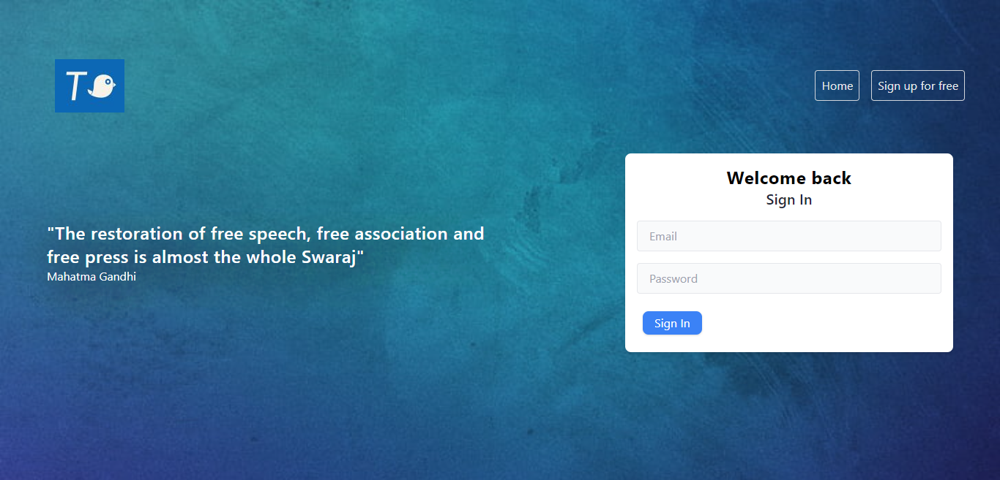
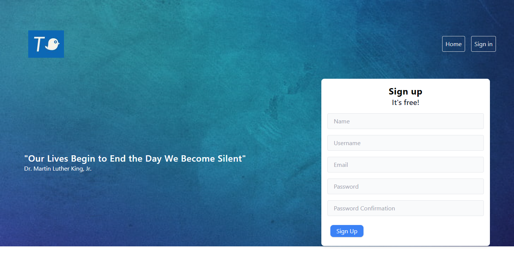
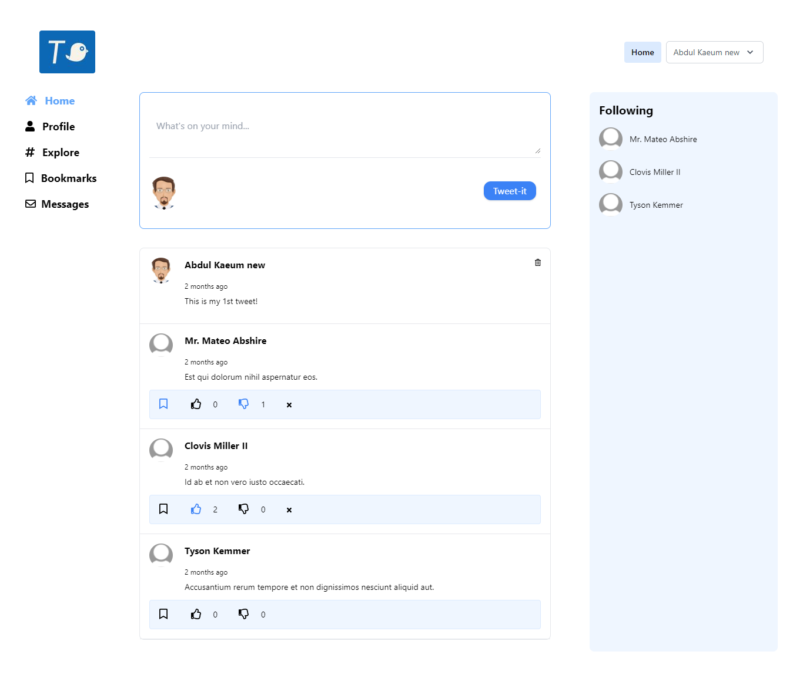
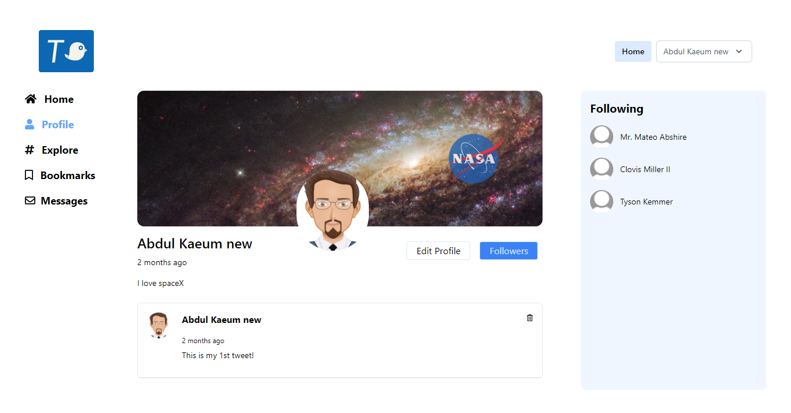
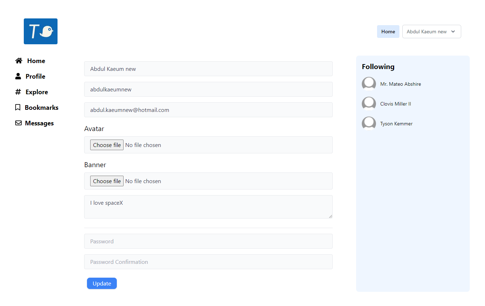
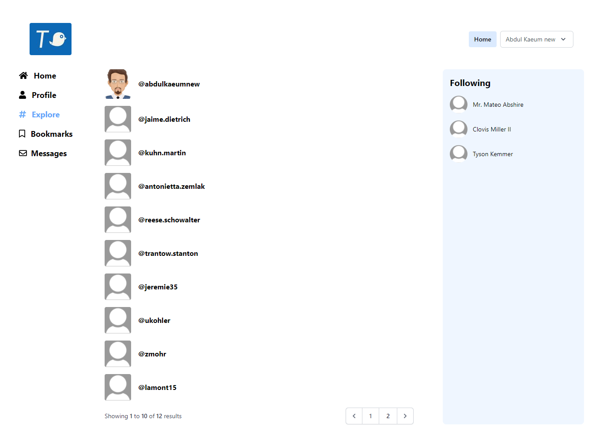
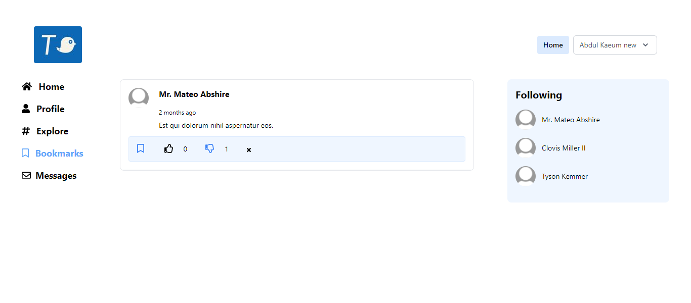

### A slim down version of a Twitter clone

#### Features
- Creating a profile, uploading an avatar and banner
- Posting and deleting your tweet
- Exploring, following and un-following users
- Liking and disliking tweets
- Bookmarking tweets
- TODO messaging users

#### Application
- Bespoke authentication for register and login
- Seeders and model factories for creating fake dummy data for testing
- Migrations + eloquent relationships + pivot tables
- Validation
- Mutators for hashing user password
- Accessor for retrieving user avatar
- Anonymous blade components v7+
- A global helper file to use common helper methods
- Policy and Gates to edit the profile
- Pagination
- Local eloquent scopes 
- Tailwind for the frontend

#### Screenshots
- Login

- Register

- Home and timeline

- Profile

- Edit profile

- Explore users

- Bookmaks

